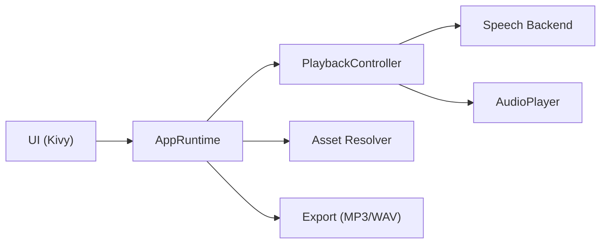

# Architecture

## Core layers

- `kookie/app.py`: runtime state and app orchestration.
- `kookie/controller.py`: synthesis and playback coordination.
- `kookie/audio.py`: audio output streaming.
- `kookie/export.py`: MP3/WAV export pipeline.
- `kookie/assets.py`: model/voice resolution and download safety.
- `kookie/ui.py`: Kivy UI and interaction wiring.

## Runtime flow

1. Load config and resolve assets.
2. Select backend (`kokoro` or `mock`).
3. Start playback controller.
4. UI polls runtime state and save progress.

## Reliability features

- Categorized errors with stable codes.
- Retry with exponential backoff.
- Local opt-in telemetry.
- Asset checksum verification and manifest tracking.
