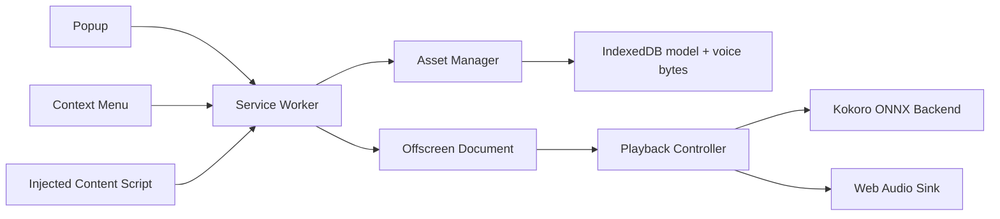

# Architecture

Kookie is a Manifest V3 Chrome extension. The service worker owns extension API coordination, while an offscreen document owns Web Audio and ONNX inference because MV3 service workers do not provide DOM or audio APIs.

## Runtime Flow


```mermaid
flowchart LR
    A["Popup"] --> B["Service Worker"]
    C["Context Menu"] --> B
    D["Injected Content Script"] --> B
    B --> E["Asset Manager"]
    E --> F["IndexedDB model + voice bytes"]
    B --> G["Offscreen Document"]
    G --> H["Playback Controller"]
    H --> I["Kokoro ONNX Backend"]
    H --> J["Web Audio Sink"]
```

## Core Modules

- `serviceWorker.js`: handles popup messages, context menu events, settings persistence, asset readiness, and offscreen document lifecycle.
- `offscreen.js`: creates the playback controller and receives playback commands from the service worker.
- `assetManager.js`: downloads model assets, validates optional SHA-256 values, stores large bytes in IndexedDB, and stores metadata in `chrome.storage.local`.
- `kokoroBackend.js`: loads `onnxruntime-web`, creates the ONNX session, prepares Kokoro tensors, and yields audio chunks.
- `playbackController.js`: normalizes and chunks text, drives synthesis, tracks playback state, clamps rate/volume, and reports progress.
- `popup.js`: binds the reader UI to extension messages.
- `contentScript.js`: extracts selected text or readable page text when requested.

## Storage

- `chrome.storage.local`: settings and asset metadata.
- IndexedDB database `kookie-assets`: model and voice bytes.
- No user text is sent to a server by Kookie. Model assets are downloaded from the configured Hugging Face URLs.

## Permissions

- `activeTab`: import text from the current tab after user action.
- `contextMenus`: read selected text from the right-click menu.
- `offscreen`: hidden document for Web Audio and ONNX runtime work.
- `scripting`: inject content extraction only when needed.
- `storage`: persist settings and asset metadata.

## Testing

Unit tests run with Node's built-in test runner:

```bash
npm --prefix extension test
```

The unit suite covers text processing, settings, assets, playback state, message validation, and repo-shape checks.
